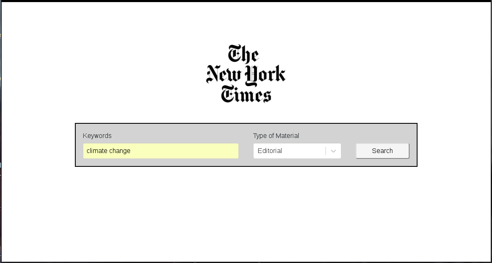
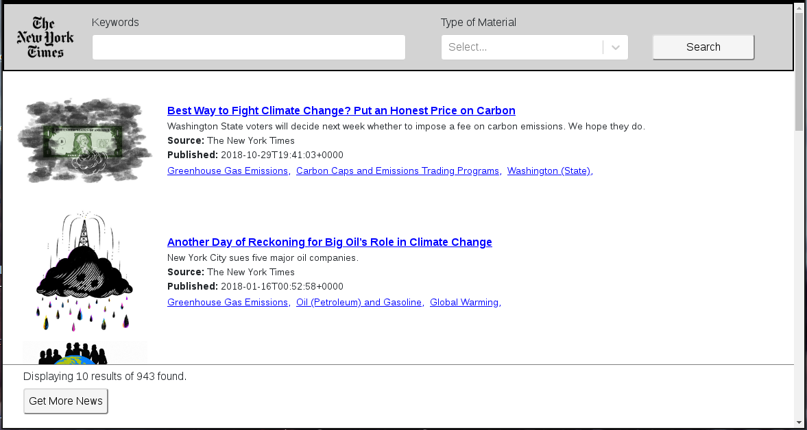
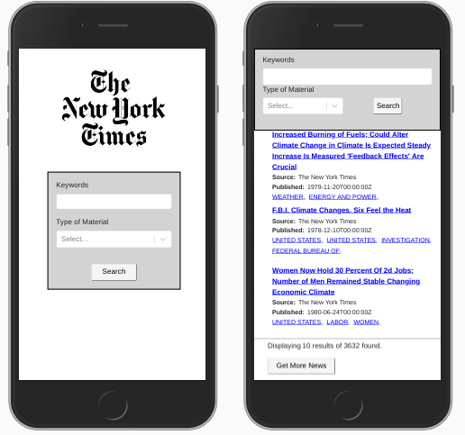

# New York Time Search

Aplicación con interfaz de busqueda de noticias en el *New York Times*

### Uso:

```
$ npm install
$ npm start
```

---------------------------------
La aplicación abre en el puerto 9000. Al iniciar tenemos la pantalla de bienvenida donde podemos realizar la busqueda con palabras clave y eligiendo el tipo de material que deseamos, por ejemplo para buscar editoriales sobre cambio climático:

<p align="center">
  
</p>

Los resultados son mostrados com se ve en la siguiente imagen. Vemos 10 resultados y podemos obtener más con el botón inferior. También podemos realizar una nueva busqueda en la barra superior.

<p align="center">
  
</p>

Si usamos un celular para interactuar con la aplicación tenemos las siguientes vistas:

<p align="center">
  
</p>
